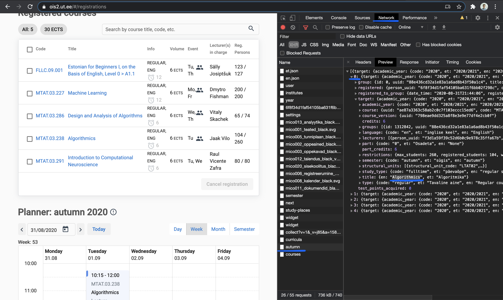

# ois-class-watcher

## How to Install

You need `npm` and `node` to run this. If you don't have them, check out [this article](https://jstopics.com/nodejs/5-ways-to-install-nodejs-in-2019).

1. `git clone git@github.com:nick-baliesnyi/ois-class-watcher.git`
2. `cd ois-class-watcher`
3. `npm install`
4. `cp .env.example .env`
5. Open `.env` file and add your OIS credentials

## How to Use

`watcher.js` has comments that start with `TODO:` on what you should change to make it work.

To find the index of the class or group that you want, go to the OIS dashboard and see the response to the `autumn` request in the DevTools Network panel — check the screenshot below.

